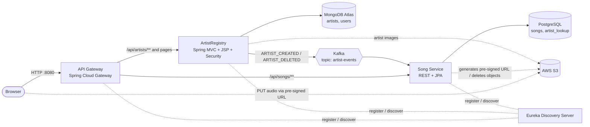

# 🎵 Resonance

> A microservices music platform in the spirit of Spotify / Apple Music, where artists are registered and managed, songs are uploaded and streamed, and every request flows through a single API Gateway. Built with **Spring Boot 4**, **Spring Cloud (Eureka + Gateway)**, **Apache Kafka**, **MongoDB**, **PostgreSQL**, and **AWS S3**, and run as Docker containers on **AWS EC2**.

---

## 📸 Overview

Resonance started as a single Spring MVC app (an artist registry) and has been rebuilt as an event-driven microservice system. Users browse and search artists, open artist pages with their discography, play tracks in the browser, and (when signed in) add, edit, and delete artists and songs. Large audio files go from the browser straight to S3 via **pre-signed URLs**, so they never pass through the backend.

---

## 🧩 Architecture



### Services

| Service | Port | Responsibility | Data store |
|---|---|---|---|
| **API-Gateway** | 8080 | Single public entry point. Routes `/api/artists/**` → ArtistRegistry, `/api/songs/**` → Song Service, everything else (JSP pages) → ArtistRegistry. Load-balances via Eureka (`lb://`), handles CORS and forwarded headers. | – |
| **Discovery-Server** | 8761 | Netflix Eureka registry. Every service registers here, so nothing hardcodes another service's address. | in-memory |
| **ArtistRegistry** | 8083 | JSP frontend (view controller), artist REST API, authentication (form login + Google OAuth2), artist image upload to S3, publishes artist events to Kafka. | MongoDB |
| **song-Service** | 8081 | Song CRUD, pre-signed S3 upload URLs, S3 object cleanup, consumes artist events from Kafka. | PostgreSQL |
| **Kafka** | 9092 | Event backbone between ArtistRegistry and Song Service. | – |

### Key Design Decisions

- **API Gateway as the only public entry point.** The browser talks to one origin (`:8080`). Pages and APIs are served from the same origin, so the front end uses relative URLs (`/api/songs/...`) and needs no CORS between them.
- **Service discovery with Eureka.** Gateway routes use `lb://ServiceName`, so instances can move or scale without config changes.
- **Event-driven artist sync with Kafka.** ArtistRegistry owns artists. When an artist is created or deleted, it publishes an event to the `artist-events` topic (keyed by the artist's Mongo ID). Song Service consumes it and keeps a small local `artist_lookup` table in PostgreSQL. This means listing songs never needs a live call to ArtistRegistry, which keeps the services decoupled and fast.
- **Cascade deletes via events.** When an `ARTIST_DELETED` event arrives, Song Service removes that artist's songs and its lookup row.
- **Pre-signed URL uploads for large files.** Audio files go browser → S3 directly. The backend only signs a short-lived URL and stores the resulting S3 link, so large uploads never consume service memory or bandwidth.
- **Database per service (polyglot persistence).** MongoDB suits the flexible artist documents and Atlas-backed search; PostgreSQL suits the relational song ↔ artist many-to-many model.
- **Dual auth strategy.** Form login and Google OAuth2 converge on the same `UserPrincipal`/session model, so downstream code doesn't care how the user signed in.
- **Cross-cutting concerns with AOP.** `LoggingAspect`, `GlobalNavigationAdvice` and `GlobalExceptionHandler` keep controllers and services focused on business logic.

---

## ✨ Features

### 🎧 Music
- **Browse and play** tracks from an artist's page using a shared in-browser audio player
- **Add, edit, and delete songs** per artist (including multi-artist songs)
- **Direct-to-S3 uploads** using pre-signed URLs (10-minute expiry) for bulky audio files
- Deleting a song also removes its object from S3

### 🔍 Discovery
- Search artists by **name or genre** (MongoDB, paginated)
- **Library** page with top artists (ranked by view count) and **genre shelves** that load more on scroll
- Artist detail pages populated through the REST API and the Fetch API

### 🎤 Artist management
- Add, edit, and delete artists with image upload (cover art stored in S3)
- Artist **view counts** tracked per page view
- Deleting an artist cascades to their songs through Kafka

### 🔐 Authentication & security
- Spring Security with session-based login and BCrypt password hashing
- **Google OAuth2 sign-in** alongside username/password
- Custom `UserDetailsService` backed by MongoDB, with `UserPrincipal` bridging both login methods
- Public pages and APIs are configured explicitly; everything else requires authentication

### ⚙️ Platform
- **Spring Cloud Gateway** routing with `X-Forwarded-*` headers enabled
- **Eureka** service registry
- **Kafka** producer/consumer for asynchronous service sync
- **Flyway** and **Springdoc OpenAPI** (Swagger UI) available in Song Service
- Containerized with multi-stage Docker builds (Maven build stage → slim Alpine JRE runtime)
- Unit tests for the ArtistRegistry service layer (JUnit, Mockito)

### 🎨 UI / UX
- Dark navy theme with liquid-glass cards and purple accents
- Animated login page with a spinning vinyl record and tilt effect
- JSP + JSTL views with vanilla JavaScript (Fetch API)

> **Note:** the original Spotify monthly-listener integration (RapidAPI) was deprecated for this learning project. The code is kept in the repo but disabled.

---

## 🛠️ Tech Stack

| Layer | Technology |
|---|---|
| **Language / Runtime** | Java 25, Spring Boot 4.1 |
| **Gateway & discovery** | Spring Cloud 2025.1 (Gateway WebFlux, Netflix Eureka, LoadBalancer) |
| **Messaging** | Apache Kafka (Spring for Apache Kafka, JSON events) |
| **Databases** | MongoDB Atlas (Spring Data MongoDB, `MongoTemplate`), PostgreSQL 16 (Spring Data JPA / Hibernate, Flyway) |
| **Storage** | AWS S3 (AWS SDK v2, `S3Presigner` for pre-signed URLs) |
| **Auth** | Spring Security, Google OAuth2 client |
| **Views** | JSP, JSTL, HTML5, CSS3, vanilla JS |
| **Cross-cutting** | Spring AOP, `@ControllerAdvice`, Springdoc OpenAPI |
| **Build** | Maven (Maven Wrapper per service) |
| **Containers** | Docker, Docker Compose |
| **Deployment** | AWS EC2 (Docker Compose), images on Docker Hub |

---

## 🗂️ Project Structure

```
Resonance-App/
├── API-Gateway/            # Spring Cloud Gateway — routes, CORS, load balancing
├── Discovery-Server/       # Eureka server
├── ArtistRegistry/         # Frontend (JSP), artist API, auth, Kafka producer
│   └── src/main/
│       ├── java/com/hars/ArtistRegistry/
│       │   ├── Aspect/         # LoggingAspect, GlobalNavigationAdvice, GlobalExceptionHandler
│       │   ├── Configuration/  # S3Config, WebClientConfig, WebSecurityConfig
│       │   ├── Controller/     # ArtistController (views), HomeController (REST), CustomErrorController
│       │   ├── Event/          # ArtistEvent (Kafka payload)
│       │   ├── Repository/     # Artist, User, ArtistRepo, SearchRepoImpl, ...
│       │   └── Service/        # ArtistService, LibraryService, SearchService, S3ImageService,
│       │                       # ArtistEventProducer, CustomOAuth2UserService, ...
│       └── webapp/Views/       # JSP pages
└── song-Service/           # Song API, pre-signed URLs, Kafka consumer
    └── src/main/java/com/hars/songService/
        ├── Configuration/  # S3Config, SongServiceConfig, WebClientConfig
        ├── Controller/     # SongController
        ├── Event/          # ArtistEvent
        ├── Repository/     # Song, ArtistLookup, repositories, presign DTOs
        └── Service/        # SongService, S3SongService, ArtistEventConsumer
```

---

## 🔄 Key Flows

### Uploading a song (pre-signed URL)

```
1. Browser  → POST /api/songs/presigned-url   { fileName, contentType }
2. Song Svc → returns { uploadUrl (valid 10 min), finalStorageUrl }
3. Browser  → PUT audio file directly to S3 using uploadUrl
4. Browser  → POST /api/songs                 { songName, artists, album, duration, s3URL }
5. Song Svc → saves the song row in PostgreSQL
```

### Keeping artists in sync (Kafka)

```
Create artist → ArtistRegistry saves to MongoDB
              → publishes ARTIST_CREATED to topic "artist-events"
              → Song Service consumer stores a row in artist_lookup

Delete artist → ArtistRegistry deletes from MongoDB
              → publishes ARTIST_DELETED
              → Song Service deletes the artist's songs and the lookup row
```

For artists that were added to MongoDB before Kafka existed (or directly in the database), `POST /api/songs/sync/artists` backfills the lookup table from `ArtistRegistry`'s `/api/artists/artistEvents` endpoint.

---

## 🚀 Getting Started

### Prerequisites
- Docker and Docker Compose
- A MongoDB Atlas cluster (or local MongoDB) and its connection string
- An AWS S3 bucket and credentials (an IAM role on EC2, or access keys locally)
- Google OAuth2 client ID and secret (for Google sign-in)
- *(To build without Docker)* Java 25 and Maven 3.9+

### Configuration

Secrets are never committed. Both Spring services read them from environment variables.

Create a `.env` file next to `docker-compose.yml`:

```bash
# Image repo (when pulling prebuilt images)
HUB_REPO=<dockerhub-user>/resonance

# Databases
POSTGRES_PASSWORD=<strong-password>
MONGO_URI=mongodb+srv://<user>:<password>@<cluster>.mongodb.net/?appName=<app>

# Google OAuth2
GOOGLE_CLIENT_ID=<client-id>
GOOGLE_CLIENT_SECRET=<client-secret>

# CORS origin allowed by the gateway
FRONTEND_URL=http://localhost:8080
```

Variables injected per service by Compose:

| Variable | Used by | Purpose |
|---|---|---|
| `EUREKA_SERVER_URL` | gateway, ArtistRegistry, song-service | e.g. `http://discovery-server:8761/eureka/` |
| `KAFKA_BOOTSTRAP_SERVERS` | ArtistRegistry, song-service | e.g. `kafka:9092` |
| `DB_HOST`, `DB_PORT`, `DB_USER`, `DB_PASSWORD` | song-service | PostgreSQL connection |
| `MONGO_URI` | ArtistRegistry | MongoDB Atlas connection string |
| `GOOGLE_CLIENT_ID`, `GOOGLE_CLIENT_SECRET` | ArtistRegistry | Google OAuth2 |
| `FRONTEND_URL` | api-gateway | CORS allowed origin |
| `SPRING_PROFILES_ACTIVE` | ArtistRegistry | `prod` |

AWS credentials are not set in Compose. On EC2, attach an **IAM role** with S3 access to the bucket and the AWS SDK picks it up automatically. For local runs, provide `AWS_ACCESS_KEY_ID` / `AWS_SECRET_ACCESS_KEY` through your own environment.

### Run with Docker Compose

```bash
git clone https://github.com/Harshul-Gupta/Resonance-App.git
cd Resonance-App

# Start infrastructure first, then the services (keeps JVM startup peaks apart)
docker compose up -d postgres kafka discovery-server
docker compose up -d
```

Open **http://localhost:8080**.

| URL | What |
|---|---|
| `http://localhost:8080/` | The app (via the gateway) |
| `http://localhost:8761/` | Eureka dashboard (restrict this in production) |
| `http://localhost:8081/swagger-ui.html` | Song Service OpenAPI (if the port is published) |

> Start order matters: the Discovery Server must be healthy before the other services register with it.

### Build images yourself

```bash
docker build -t <user>/resonance:discovery-server ./Discovery-Server
docker build -t <user>/resonance:api-gateway      ./API-Gateway
docker build -t <user>/resonance:artist-registry  ./ArtistRegistry
docker build -t <user>/resonance:song-service     ./song-Service
```

### S3 bucket setup

- Create a bucket and set `aws.bucket.name` / `aws.region` in each service's configuration.
- Add a **CORS rule** so browsers can upload with pre-signed URLs and play audio:

```json
[
  {
    "AllowedHeaders": ["*"],
    "AllowedMethods": ["GET", "PUT", "HEAD"],
    "AllowedOrigins": ["http://localhost:8080"],
    "ExposeHeaders": ["ETag"]
  }
]
```

---

## ☁️ Deployment (AWS EC2)

Resonance runs as a Docker Compose stack on a single EC2 instance:

1. Build and push the four service images to a private Docker Hub repository.
2. On the instance, install Docker + the Compose plugin, add `docker-compose.yml` and `.env`.
3. Attach an **IAM role** granting S3 access to the bucket (no access keys on the box).
4. Allow the instance's public IP in the MongoDB Atlas network access list.
5. In the security group, expose only the gateway port (and 22 from your IP). Keep Postgres, Kafka, Eureka, and the service ports internal to the Docker network.
6. `docker compose pull && docker compose up -d`.

Memory-conscious settings for small instances: JVM caps (`-XX:MaxRAMPercentage`), a Kafka heap limit (`KAFKA_HEAP_OPTS`), per-container `mem_limit`, and a swap file.

---

## 📡 API Reference

All requests go through the gateway at `:8080`.

### Artist API (ArtistRegistry — `/api/artists`)

| Method | Endpoint | Description |
|---|---|---|
| `GET` | `/api/artists/{id}` | Get an artist |
| `GET` | `/api/artists/search?name=&genre=&page=` | Paginated search by name/genre |
| `GET` | `/api/artists/topArtists?pageNumber=` | Top artists by view count |
| `GET` | `/api/artists/genre/{genre}?pageNumber=` | Artists in a genre (paginated) |
| `POST` | `/api/artists/send` | Create an artist (multipart: artist JSON + image) |
| `PATCH` | `/api/artists/{mongoId}` | Update an artist (multipart) |
| `DELETE` | `/api/artists/{mongoId}` | Delete an artist (publishes `ARTIST_DELETED`) |
| `POST` | `/api/artists/{mongoId}/view` | Increment the view count |
| `POST` | `/api/artists/user` | Register a user |
| `GET` | `/api/artists/artistEvents` | List artists as events (used for the initial sync) |

### Song API (song-service — `/api/songs`)

| Method | Endpoint | Description |
|---|---|---|
| `GET` | `/api/songs/{id}` | Get a song |
| `GET` | `/api/songs/artist/{mongoId}` | All songs by an artist |
| `POST` | `/api/songs/presigned-url` | Get a pre-signed S3 upload URL (`{ fileName, contentType }`) |
| `POST` | `/api/songs` | Create a song record after the S3 upload |
| `PATCH` | `/api/songs/{id}` | Update song fields |
| `DELETE` | `/api/songs/{id}` | Delete a song (and its S3 object) |
| `POST` | `/api/songs/sync/artists` | Backfill `artist_lookup` from ArtistRegistry |

### Page routes (ArtistRegistry views)

| Route | View |
|---|---|
| `/` | Landing page with registry stats |
| `/search` | Search results |
| `/library` | Library: top artists and genre shelves |
| `/genre/{genre}` | Artists in a genre |
| `/artist-details/{id}` | Artist page with tracks and player |
| `/artist-details/{id}/add-song` | Add a song |
| `/artist-details/{id}/edit-song/{songId}` | Edit a song |
| `/add`, `/artist/manage/{id}`, `/artist/edit/{id}` | Add / manage / edit artist |
| `/register`, `/login` | Registration and login (form + Google) |

---

## 🧠 Skills Demonstrated

| Skill | Where |
|---|---|
| Microservice architecture | Gateway, Eureka, ArtistRegistry, Song Service |
| API Gateway routing & load balancing | `API-Gateway/application.yml` (`lb://` routes) |
| Service discovery | Eureka server and clients |
| Event-driven design (Kafka) | `ArtistEventProducer`, `ArtistEventConsumer` |
| Polyglot persistence | MongoDB (artists/users) + PostgreSQL (songs) |
| AWS S3 pre-signed URL uploads | `S3SongService`, `addSong.jsp` |
| Spring Security + OAuth2 | `WebSecurityConfig`, `CustomOAuth2UserService` |
| Spring AOP / `@ControllerAdvice` | `LoggingAspect`, `GlobalExceptionHandler` |
| Custom MongoDB queries | `SearchRepoImpl` (`MongoTemplate`) |
| JPA many-to-many modelling | `Song` ↔ `ArtistLookup` |
| Containerization | Multi-stage Dockerfiles, Docker Compose |
| Cloud deployment | AWS EC2, IAM roles, security groups |
| Unit testing | JUnit + Mockito service tests |

---

## 🗺️ Roadmap

- Stream counts and release dates for songs
- HTTPS with a custom domain in front of the gateway
- Centralised secrets (AWS Secrets Manager / SSM Parameter Store)
- Return `404` instead of `500` for missing songs, and tighten error handling in Song Service
- Disable Swagger UI in production profiles

---

## 📄 License

MIT © Harshul Gupta
